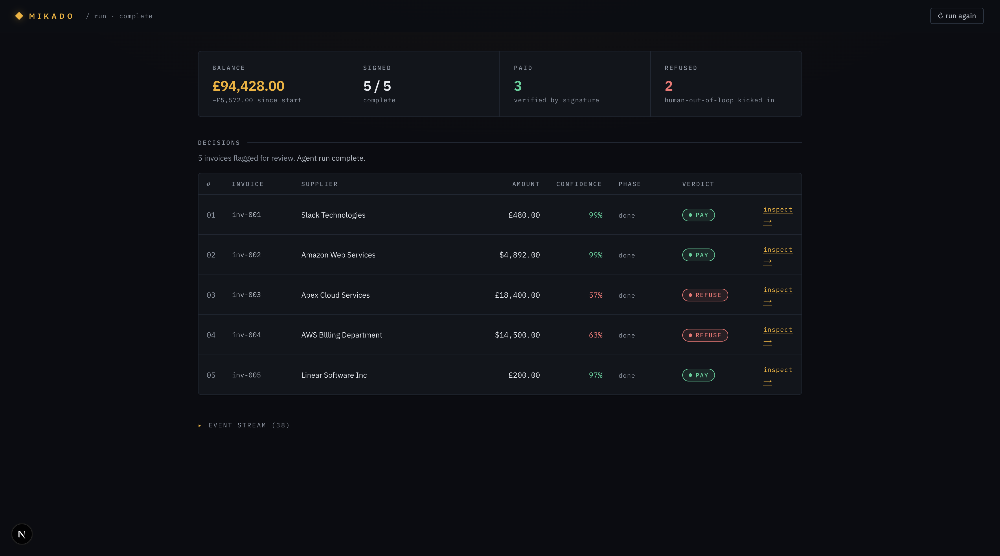
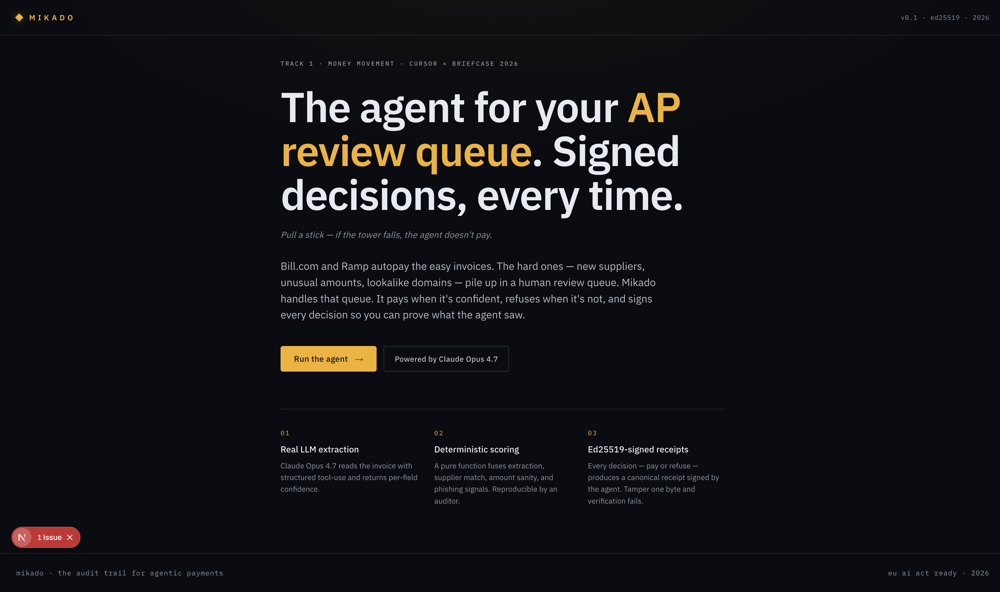
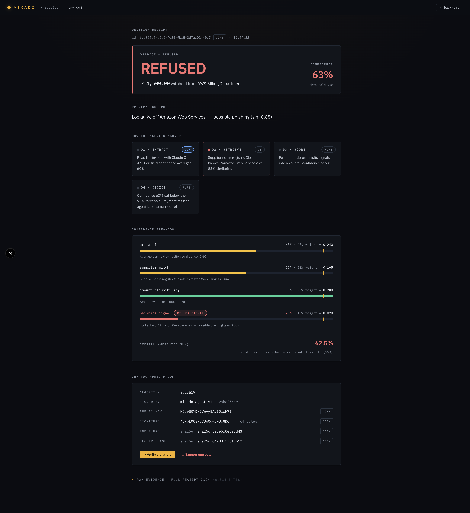
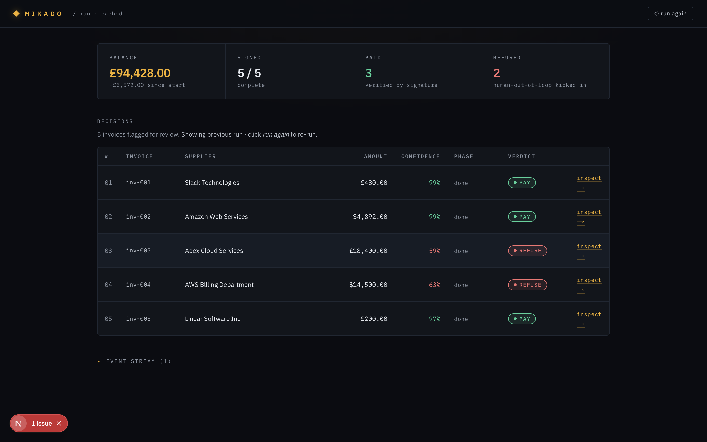

<div align="center">

# Mikado

**The AI agent for your AP review queue. Signed decisions, every time.**

_Pull a stick — if the tower falls, the agent doesn't pay._

[](https://cursor.com)
[](#)
[](#)

[](https://nextjs.org)
[](#)
[](https://anthropic.com)
[](#)

<br />



</div>

---

## The problem

Bill.com, Ramp, Brex autopay the easy invoices — Slack, AWS, the utilities, anything that matches a rule.

Every month, a chunk of invoices fall through:

- **New vendors** you've never paid before
- **Unusual amounts** on familiar names
- **Lookalike domains** that look almost-but-not-quite right

Those land in a human's inbox for review. **That queue is the bottleneck.** And it's where business email compromise wins — a tired AP clerk at 4pm rubber-stamps a phishing invoice, and £14,000 walks out the door to a Caribbean account your insurance won't cover.

## The product

> **Mikado is the AI agent for your AP review queue.** It pays the safe invoices, refuses the suspicious ones, and signs every decision so your CFO can read the agent's reasoning on Monday morning instead of digging through Slack.

Five things happen for every flagged invoice:

| #   | Step       | What                                                                                       |
| --- | ---------- | ------------------------------------------------------------------------------------------ |
| 1   | **Read**   | Claude Opus 4.7 extracts supplier, amount, currency, dates — with per-field confidence.    |
| 2   | **Check**  | Look the supplier up in the registry. Catch lookalikes (alias-similarity, not exact match). |
| 3   | **Score**  | Fuse four deterministic signals into one overall confidence number.                         |
| 4   | **Decide** | Above 95% threshold → PAY. Below → REFUSE. No LLM in this step — pure function.            |
| 5   | **Sign**   | Ed25519 signature over the canonical receipt body. Tamper one byte, verification fails.    |

Refusals don't get autopaid. Refusals also don't sit in a queue. They get **signed and timestamped**, and the next time someone asks "why didn't we pay AWS?" — you open the receipt, read the agent's reasoning, and ship.

---

## Demo path

> Live at `localhost:3000` after `npm run dev`. The flow below is identical to the hackathon pitch and `DEMO.md`.

### 1 · Land on the home page

Tagline up front. One click into the ledger.



### 2 · Run the agent

Five flagged invoices stream through the four-phase loop. Three pay (Slack, a recurring utility, an established vendor). Two refuse — including an `AWS Bllling Department` lookalike with a `$14,500` urgent wire request to a Caribbean account.


### 3 · Inspect the refused phishing invoice

Click `inspect →` on row 04. Receipt opens with the agent's primary concern in **one sentence**, then the four-phase reasoning, the confidence breakdown, and at the bottom — the cryptographic proof.



> Verifying the signature recomputes the canonical body and checks Ed25519 against the agent's public key. **Tamper one byte → verification fails.** That's audit evidence, not a Slack message.

### 4 · Back to the ledger

Hit `← back to run`. The ledger restores from session cache instantly — the agent does **not** re-run, and you don't lose the state you were investigating.



---

## How the agent works

Four phases. Each one is its own file under `lib/agent/`. **Three are pure / deterministic; only `extract` calls the LLM.**

```
┌──────────┐   ┌──────────┐   ┌──────────┐   ┌──────────┐
│ extract  │ → │ retrieve │ → │  score   │ → │  decide  │ → signed Receipt
└──────────┘   └──────────┘   └──────────┘   └──────────┘
   Claude       in-memory       pure fn        pure fn
   Opus 4.7     supplier        weighted       threshold
   tool-use     registry        signal sum     check
```

| Phase      | Type      | What it does                                                                                       |
| ---------- | --------- | -------------------------------------------------------------------------------------------------- |
| `extract`  | LLM       | Reads the invoice with Claude Opus 4.7 (structured tool-use). Returns supplier, amount, currency, line items, per-field confidence. |
| `retrieve` | In-memory | Looks the supplier up in `data/suppliers.ts`. Detects lookalikes via alias matching (`AWS Bllling` → `Amazon Web Services`, ~0.85 sim). |
| `score`    | Pure      | Combines four signals: extraction confidence, supplier-match score, amount-vs-history sanity, phishing risk. Weighted sum, no randomness. |
| `decide`   | Pure      | If `overall ≥ threshold (0.95)` → `PAY`. Else → `REFUSE`. Single line of business logic.            |

The boundary is intentional: **stochasticity is bounded to extraction**. Score and decide are deterministic, so the same invoice always produces the same decision. That's what makes the receipt admissible as evidence rather than a model trace someone can argue with.

The receipt itself is the **canonicalized JSON** of all four phase outputs plus inputs, hashed with SHA-256, and signed with Ed25519. `lib/crypto/sign.ts` round-trips through `signReceipt → verifyReceipt = true`, and `signReceipt → flip-byte → verifyReceipt = false`. Verified by `scripts/check-crypto.ts`.

---

## Tech stack

| Layer       | Choice                                                       |
| ----------- | ------------------------------------------------------------ |
| Framework   | Next.js 15 (App Router, TypeScript strict)                   |
| Runtime     | Node — for `crypto` Ed25519                                  |
| LLM         | Anthropic Claude Opus 4.7 via `@anthropic-ai/sdk`            |
| Streaming   | Native `ReadableStream` + Server-Sent Events (no socket.io)  |
| State       | Plain `useState` + module-level singletons (no Redux/Zustand) |
| Storage     | In-memory map + on-disk JSON in `receipts/` (no database)    |
| Styling     | Tailwind for layout, custom CSS for the design system        |
| Fonts       | IBM Plex Sans / Mono via `next/font/google`                  |

> No Postgres. No Plaid. No NestJS. No auth. No mobile. Single Next.js app.

---

## Run locally

```bash
git clone https://github.com/devanshkaria88/cursor-hackathon-mikado.git
cd cursor-hackathon-mikado
npm install

# add your Anthropic key
echo "ANTHROPIC_API_KEY=sk-ant-..." > .env.local

npm run dev
```

Open `http://localhost:3000`. The agent's signing keypair is generated on first run into `.keys/` (gitignored).

Optional — verify the crypto invariants on the spine:

```bash
npx tsx scripts/check-crypto.ts
```

---

## Repository structure

```
mikado/
├── app/
│   ├── page.tsx                      # Home — pitch + CTA
│   ├── run/page.tsx                  # /run — Decision ledger (live SSE stream)
│   ├── receipt/[id]/
│   │   ├── page.tsx                  # Receipt server component
│   │   └── DecisionReceipt.tsx       # Story-first receipt UI
│   ├── api/
│   │   ├── run/route.ts              # SSE: stream the four phases per invoice
│   │   ├── verify/route.ts           # POST { receipt } → { valid: boolean }
│   │   └── receipts/[id]/route.ts    # GET a receipt by id
│   ├── globals.css                   # Design-system tokens + utility classes
│   └── layout.tsx                    # Root layout, font wiring
│
├── lib/
│   ├── agent/
│   │   ├── extract.ts                # Phase 1 — Anthropic structured tool-use
│   │   ├── retrieve.ts               # Phase 2 — supplier registry + lookalikes
│   │   ├── score.ts                  # Phase 3 — pure deterministic signals
│   │   ├── decide.ts                 # Phase 4 — threshold check
│   │   └── runAgent.ts               # Orchestrates the four phases per invoice
│   ├── crypto/
│   │   ├── sign.ts                   # signReceipt / verifyReceipt (Ed25519)
│   │   ├── hash.ts                   # canonical JSON SHA-256
│   │   └── keys.ts                   # ensure / load keypair from .keys/
│   ├── mock/bank.ts                  # in-memory bank balance for the demo
│   ├── store.ts                      # receipts map (in-memory + disk)
│   └── types.ts                      # Receipt, Phase, Signal, …
│
├── components/ui/primitives.tsx      # TopBar, Pill, KeyValue, SignalBar, …
├── data/invoices.ts                  # Five hand-crafted demo invoices
├── data/suppliers.ts                 # In-memory supplier registry
├── docs/                             # PRD, architecture, backend, frontend specs
├── screenshots/                      # README + DEMO.md screenshots
├── scripts/check-crypto.ts           # one-shot crypto invariant check
├── DEMO.md                           # 1-person demo walkthrough
├── PITCH_2P.md                       # 2-person staged pitch script
└── README.md                         # this file
```

---

## Built with Cursor

Cursor sat at the centre of the build for ~3 hours of solo work. Things that stand out:

- **Project rules** — `.cursor/rules/mikado.mdc` codifies the non-negotiables: the 90-second demo path is locked, real Ed25519 signing (never mocked), real Anthropic API in `extract.ts` (never mocked), mock everything else, no premature abstraction. Every Cursor agent loaded these rules first.
- **Custom skill** — `.cursor/skills/ui-ux-pro-max/` is a Python design-recommendation engine I dropped in mid-build. When the original retro game UI started feeling wrong for an audit-trail product, I asked the skill for a redesign and got the data-dense dashboard pattern you see now.
- **Background agents** — sprite generation, score-breakdown formatting, and seed-data work all ran in parallel Cursor agents while the foreground stayed on the agent loop and signing.
- **Documentation-first** — `docs/PRD.md`, `docs/architecture.md`, `docs/backend.md`, `docs/frontend.md` were written before any code. Cursor read them as ground truth and pushed back when the implementation tried to deviate.

> Hackathon side-quest: **Best use of Cursor.** Project rules + custom skill + parallel background agents + docs-as-prompt — Cursor was the team here, not just the editor.

---

## Why "Mikado"

Mikado is a children's game where players pull sticks from a pile without disturbing the others. One wrong move and the tower collapses.

Mikado the agent does the same: every flagged invoice is a stick. High confidence is a safe pull — pay it. Low confidence — if the agent acts, the integrity of the audit trail falls. So it doesn't act. It signs the refusal instead.

> **Pull a stick. If the tower falls, the agent doesn't pay.**

---

## Footnote — regulatory context

The EU AI Act enters its general-purpose AI obligations in **August 2026**, with audit-trail requirements for AI making consequential financial decisions and fines up to €35M / 7% of global revenue. Mikado's signed receipts are designed to be admissible as that audit trail without retrofit.

This was the original framing for the project. The demo focuses on the **workflow benefit** instead — AP review queue + BEC defence — because that's the value an AP director feels Monday morning, not in twelve months.

---

<div align="center">

Built solo by **Devansh** ([@devanshkaria88](https://github.com/devanshkaria88)) on **30 April 2026** at the Cursor × Briefcase London hackathon.

`localhost:3000` — drop in an Anthropic key and run the demo.

</div>
